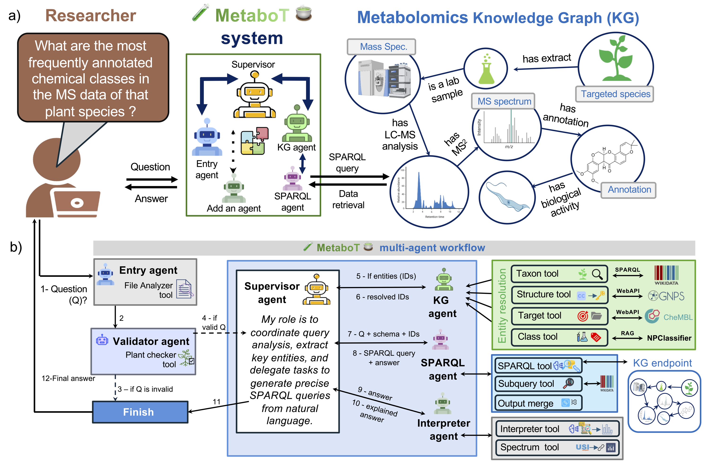

<div align="center">
<br>


<p><em>LLM-based multi-agent framework for interactive analysis of mass spectrometry metabolomics knowledge graphs</em></p>

<p>
  Natural-language questions to schema-aware SPARQL &nbsp;·&nbsp;
  Authoritative entity resolution &nbsp;·&nbsp;
  Interactive metabolomics data mining
</p>

<p>
  <a href="https://github.com/HolobiomicsLab/MetaboT/stargazers"></a>
  <a href="https://opensource.org/licenses/Apache-2.0"></a>
  <a href="https://holobiomicslab.github.io/MetaboT/"></a>
  <a href="https://metabot.holobiomicslab.eu"></a>
  <a href="https://doi.org/10.21203/rs.3.rs-6591884/v1"></a>
  <a href="https://doi.org/10.5281/zenodo.19715403"></a>
</p>
</div>

---

## v1.1.0 Highlights

- Hardened the interpreter path by isolating LLM-generated Python behind trusted-mode controls and a subprocess runner instead of in-process execution.
- Improved CLI safety with better file staging validation, collision handling, session-scoped logging, and consistent `--api-key` propagation through fallback SPARQL paths.
- Made the Streamlit app easier to launch locally by stabilizing its import path handling and aligning the recommended startup command with the tested repo-root workflow.

=======
## Demo

Try the public MetaboT demonstrator at [metabot.holobiomicslab.eu](https://metabot.holobiomicslab.eu). It is connected to the Experimental Natural Products Knowledge Graph (ENPKG), an open metabolomics knowledge graph built from a chemodiverse collection of [1,600 plant extracts](https://doi.org/10.1093/gigascience/giac124).

Full documentation is available at [holobiomicslab.github.io/MetaboT](https://holobiomicslab.github.io/MetaboT/).

## Table of Contents

- [What is MetaboT?](#what-is-metabot)
- [Validation Snapshot](#validation-snapshot)
- [Architecture Overview](#architecture-overview)
- [Installation](#installation)
- [Running MetaboT](#running-metabot)
- [Using Your Own Knowledge Graph](#using-your-own-knowledge-graph)
- [Documentation](#documentation)
- [Citation](#citation)
- [License](#license)

## What is MetaboT?

MetaboT is an open-source multi-agent framework that translates natural-language metabolomics questions into executable SPARQL queries over knowledge graphs. It was designed to lower the barrier to semantic data mining for researchers working with mass spectrometry data, especially when the underlying graph is rich but difficult to query directly with RDF and SPARQL.

Compared with single-model prompting, MetaboT uses a workflow of specialized agents for question validation, entity resolution, schema-aware query generation, iterative refinement, and result interpretation. In practice, this helps reduce hallucinated identifiers and malformed queries while keeping the interaction conversational.

## Validation Snapshot

The latest manuscript reports the following benchmark results on a manually curated ENPKG evaluation set:

| System | Overall accuracy | High-complexity accuracy |
| --- | ---: | ---: |
| GPT-4o single-shot | 8.16% | 0.00% |
| MetaboT with GPT-4o mini | 12.24% | 15.79% |
| MetaboT with GPT-4o | 83.67% | 78.95% |

These numbers are reported over 49 scored questions from a 50-question benchmark, after excluding one refinement artifact described in the manuscript. The benchmark dataset is included in [app/data/evaluation_dataset.csv](app/data/evaluation_dataset.csv) and archived on [Zenodo](https://doi.org/10.5281/zenodo.19715403).

## Architecture Overview



MetaboT's workflow follows six main roles:

1. **Entry Agent** classifies whether a request is a new knowledge question or a follow-up.
2. **Validator Agent** checks whether the question is in scope for the knowledge graph schema.
3. **Supervisor Agent** decides which downstream agents should be used.
4. **KG Agent** resolves entities such as taxa, chemical classes, SMILES strings, and biological targets using external resources. In the current codebase this role is implemented by `ENPKG_agent`.
5. **SPARQL Query Runner Agent** builds and executes schema-aware SPARQL through `GraphSparqlQAChain`.
6. **Interpreter Agent** summarizes results and can generate visual outputs when requested.

Entity resolution is grounded in tools and resources such as Wikidata, ChEMBL, NPClassifier, and GNPS rather than relying only on an LLM's internal memory.

## Installation

### Prerequisites

- Python 3.11
- Conda or Miniconda recommended
- An API key for at least one supported LLM provider
- Optional: LangSmith credentials for tracing

The default local setup targets the public ENPKG endpoint, so you can start without deploying your own knowledge graph.

### 1. Clone the repository

```bash
git clone https://github.com/HolobiomicsLab/MetaboT.git
cd MetaboT
```

### 2. Create the environment

```bash
conda env create -f environment.yml
conda activate metabot
```

To launch the application through Streamlit, install the dependencies and run the app from the repository root. In your terminal, execute:

```bash
pip install -r requirements.txt
python -m streamlit run streamlit_webapp/streamlit_app.py
```

This repo-root launch path is the recommended setup for local development and matches the Streamlit smoke-tested workflow used in `v1.1.0`. You can provide your OpenAI key in the sidebar once the app starts, or preconfigure contributor/admin keys through environment variables if you use those deployment paths.
If you prefer a plain virtual environment instead of Conda:

```bash
python -m venv .venv
source .venv/bin/activate
pip install -r requirements.txt
```

### 3. Configure environment variables

Create a `.env` file in the project root:

```env
OPENAI_API_KEY=your_api_key_here

# Optional: override the default ENPKG endpoint
KG_ENDPOINT_URL=https://enpkg.commons-lab.org/graphdb/repositories/ENPKG

# Optional: endpoint authentication
SPARQL_USERNAME=
SPARQL_PASSWORD=

# Optional: tracing
LANGCHAIN_API_KEY=
LANGCHAIN_PROJECT=MetaboT
LANGCHAIN_ENDPOINT=https://api.smith.langchain.com
```

MetaboT also includes provider mappings for `DEEPSEEK_API_KEY`, `ANTHROPIC_API_KEY`, `GEMINI_API_KEY`, `MISTRAL_API_KEY`, `OVHCLOUD_API_KEY`, and `HUGGINGFACE_API_KEY`. See the [configuration guide](docs/user-guide/configuration.md) for details.

## Running MetaboT

### Command-line examples

Run a predefined standard question:

```bash
python -m app.core.main -q 1
```

Run a custom question:

```bash
python -m app.core.main -c "What are the SIRIUS structural annotations for Tabernaemontana coffeoides?"
```

Override the endpoint at runtime:

```bash
python -m app.core.main -c "Which lab extracts show inhibition above 50% against Leishmania donovani?" --endpoint https://your-endpoint.example/sparql
```

MetaboT saves all result sets to CSV files in a temporary folder and returns the file path. When results are small, they are also displayed inline; for large result sets, only the file path is returned to avoid exceeding the LLM context window.

### Streamlit web app

The repository also includes a Streamlit interface:

```bash
pip install -r requirements.txt
export PYTHONPATH="$(pwd):${PYTHONPATH}"
streamlit run streamlit_webapp/streamlit_app.py
```

After the app starts, enter your OpenAI API key in the Streamlit sidebar under `Set a OpenAI API Key`.

### Docker

```bash
docker-compose build
docker-compose run --rm metabot python -m app.core.main -q 1
```

## Using Your Own Knowledge Graph

To apply MetaboT beyond the public ENPKG deployment:

1. Convert your processed and annotated mass spectrometry results into a compatible knowledge graph. The [ENPKG project](https://github.com/enpkg) is the recommended starting point.
2. Deploy a SPARQL endpoint for that graph.
3. Set `KG_ENDPOINT_URL` in `.env` or pass `--endpoint` at runtime.
4. If your schema differs substantially from ENPKG, update the schema-aware prompts in [app/core/agents/validator/prompt.py](app/core/agents/validator/prompt.py) and [app/core/agents/sparql/tool_sparql.py](app/core/agents/sparql/tool_sparql.py).

Because the system is schema-aware, portability is good, but prompt and resolver tuning may still be needed for a new graph.

## Documentation

- [Documentation site](https://holobiomicslab.github.io/MetaboT/)
- [Installation guide](docs/getting-started/installation.md)
- [Quick start](docs/getting-started/quickstart.md)
- [System overview](docs/user-guide/overview.md)
- [Configuration guide](docs/user-guide/configuration.md)
- [Examples](docs/examples/basic-usage.md)
- [Contributing guide](docs/contributing.md)

## Citation

If you use MetaboT in research, please cite:

Bekbergenova M, Pradi L, Navet B, Tysinger E, Michel F, Feraud M, Taghzouti Y, Legrand M, Jiang T, Chen YZ, Hassoun S, Kirchhoffer O, Wolfender JL, Mehl F, Pagni M, Bittremieux W, Gandon F, Nothias LF. **MetaboT: An LLM-based Multi-Agent Framework for Interactive Analysis of Mass Spectrometry Metabolomics Knowledge Graphs.** Research Square preprint. DOI: [10.21203/rs.3.rs-6591884/v1](https://doi.org/10.21203/rs.3.rs-6591884/v1)

The archived evaluated version and benchmark release are available at [10.5281/zenodo.19715403](https://doi.org/10.5281/zenodo.19715403).

## License

MetaboT is released under the Apache 2.0 License. See [LICENSE.txt](LICENSE.txt).

## Acknowledgement

MetaboT is a founding proof-of-concept within the [MetaboLinkAI](https://www.metabolinkai.net) program for open AI-assisted metabolomics.
