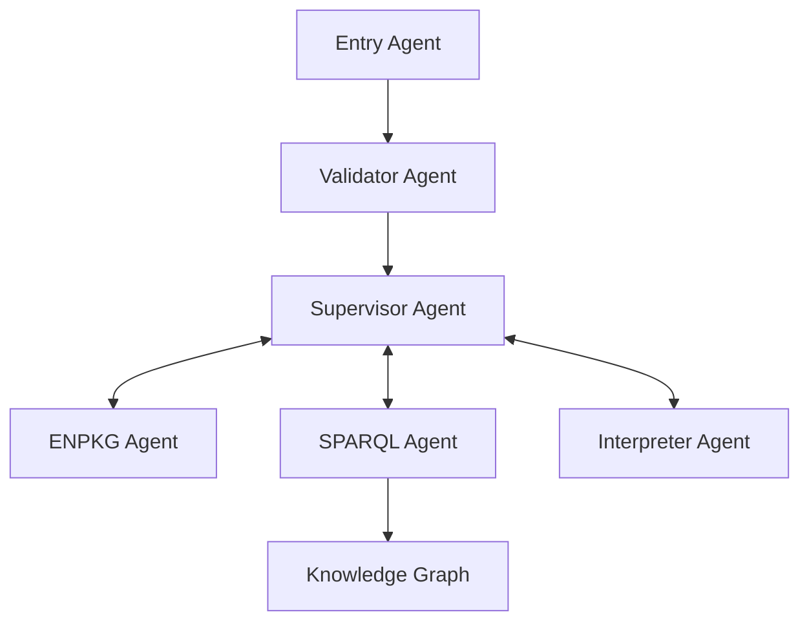

  

    <h1 class="hero__title"> 🧪 MetaboT 🍵 </h1>
    
Leveraging AI and knowledge graph for metabolomics analysis

    

      <a href="getting-started/quickstart/" class="hero__button hero__button--primary">Get Started</a>
    

  

# Welcome to 🧪 MetaboT 🍵 🚀

> Take a break, brew a cup of tea 🍵, and let 🧪 MetaboT 🍵 dig into your mass spec data! While you enjoy your favorite brew, our AI system will be busy infusing your data with meaning. Sip, smile, and watch the insights steep into brilliance! ✨

👉 **Try the MetaboT Web App**: [https://metabot.holobiomicslab.cnrs.fr](https://metabot.holobiomicslab.cnrs.fr)

## Key Features ✨

- **AI-Powered Analysis** :robot:: Utilizes LangChain and various AI agents for intelligent data processing.
- **Graph-Based Architecture** :chart_with_upwards_trend:: Built on robust graph management systems for complex data relationships.
- **SPARQL Integration** :link:: Advanced querying capabilities for metabolomics data.
- **Extensible Framework** :wrench:: Modular design allowing for easy extension and customization.

## Project Overview 🔬 {#project-overview}

🧪 MetaboT 🍵 is designed to help researchers and scientists in:

- Processing and analyzing metabolomics data.
- Identifying complex patterns and relationships.
- Generating insights from metabolomics experiments.
- Managing and querying large-scale metabolomics datasets.

## Quick Links 🔗

- [Installation Guide :arrow_down:](getting-started/installation.md)
- [Quick Start Tutorial :zap:](getting-started/quickstart.md)
- [API Reference :book:](api-reference/core.md)
- [Example Usage :computer:](examples/basic-usage.md)

## Architecture 🏗️

🧪 MetaboT 🍵 is built with a modular architecture consisting of several key components:

## Contributing 🤝

We welcome contributions! Please see our [Contributing Guide](contributing.md) for details on how to:

- Submit bug reports and feature requests
- Contribute code changes
- Improve documentation
- Participate in the community

## License 📜

This project is licensed under the Apache License - see the [LICENSE](https://github.com/HolobiomicsLab/MetaboT/blob/main/LICENSE.txt) file for details.

## Citation 🔖

If you use 🧪 MetaboT 🍵 in your research, please cite as follows:

**🧪 MetaboT 🍵: An LLM-based Multi-Agent Framework for Interactive Analysis of Mass Spectrometry Metabolomics Knowledge**  
*Madina Bekbergenova, Lucas Pradi, Benjamin Navet, Emma Tysinger, Matthieu Feraud, Yousouf Taghzouti, Martin Legrand, Tao Jiang, Franck Michel, Yan Zhou Chen, Soha Hassoun, Olivier Kirchhoffer, Jean-Luc Wolfender, Florence Mehl, Marco Pagni, Wout Bittremieux, Fabien Gandon, Louis-Félix Nothias. PREPRINT (Version 1) available at Research Square*

**Institutions:**

- Université Côte d'Azur, CNRS, ICN, Nice, France
- Interdisciplinary Institute for Artificial Intelligence (3iA) Côte d'Azur, Sophia-Antipolis, France
- Department of Computer Science, University of Antwerp, Antwerp, Belgium
- Department of Electrical Engineering and Computer Science, MIT, Cambridge, MA, USA
- INRIA, Université Côte d'Azur, CNRS, I3S, France
- Department of Computer Science, Tufts University, Medford, MA 02155, USA
- Department of Chemical and Biological Engineering, Tufts University, Medford, MA 02155, USA
- Institute of Pharmaceutical Sciences of Western Switzerland, University of Geneva, Centre Médical Universitaire, Geneva, Switzerland
- School of Pharmaceutical Sciences, University of Geneva, Centre Médical Universitaire, Geneva, Switzerland
- Swiss Institute of Bioinformatics (SIB), Lausanne, Switzerland

