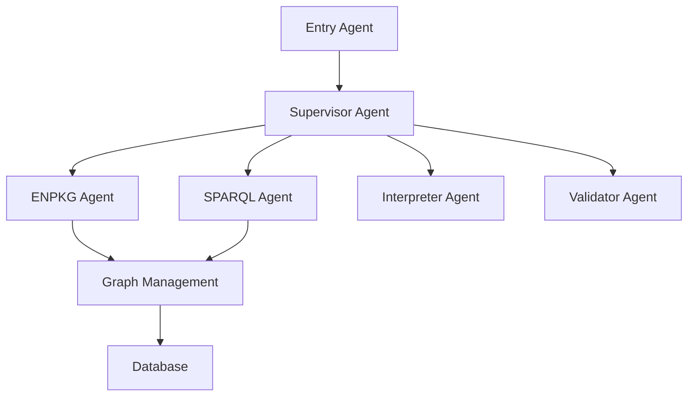

# Welcome to MetaboT

MetaboT is a powerful metabolomics analysis tool that leverages advanced AI and graph-based approaches for metabolomics data analysis and interpretation.

## Key Features

- **AI-Powered Analysis**: Utilizes LangChain and various AI agents for intelligent data processing
- **Graph-Based Architecture**: Built on robust graph management systems for complex data relationships
- **SPARQL Integration**: Advanced querying capabilities for metabolomics data
- **Extensible Framework**: Modular design allowing for easy extension and customization

## Project Overview

MetaboT is designed to help researchers and scientists in:

- Processing and analyzing metabolomics data
- Identifying complex patterns and relationships
- Generating insights from metabolomics experiments
- Managing and querying large-scale metabolomics datasets

## Quick Links

- [Installation Guide](getting-started/installation.md)
- [Quick Start Tutorial](getting-started/quickstart.md)
- [API Reference](api-reference/core.md)
- [Example Usage](examples/basic-usage.md)

## Architecture

MetaboT is built with a modular architecture consisting of several key components:



## Contributing

We welcome contributions! Please see our [Contributing Guide](contributing.md) for details on how to:

- Submit bug reports and feature requests
- Contribute code changes
- Improve documentation
- Participate in the community

## License

This project is licensed under the MIT License - see the LICENSE file for details.

## Citation

If you use MetaboT in your research, please cite:

**MetaboT: A Conversational AI-Agent for Accessible Mass Spectrometry Metabolomics Data Mining**
*Madina Bekbergenova, et al.*

```bibtex
@article{MetaboT2024,
  title = {MetaboT: A Conversational AI-Agent for Accessible Mass Spectrometry Metabolomics Data Mining},
  author = {Bekbergenova, Madina, et al},
  year = {2025,
  journal = {arXiv},
  volume = {},
  publisher = {arXiv},
  url = {https://arxiv.org/abs/}
}
```

**Institutions:**
- Université Côte d'Azur, CNRS, ICN, Nice, France
- INRIA, Université Côte d'Azur, CNRS, I3S, France
- Interdisciplinary Institute for Artificial Intelligence (3iA) Côte d'Azur, Nice, France
- School of Pharmaceutical Sciences, University of Geneva, Switzerland
- Swiss Institute of Bioinformatics (SIB), Lausanne, Switzerland

**Funding Support:**
- French government through France 2030 investment plan (ANR-15-IDEX-01)
- [MetaboLinkAI](https://www.metabolinkai.net) project (ANR-24-CE93-0012-01)
- Swiss National Foundation project [189921](https://data.snf.ch/grants/grant/189921)