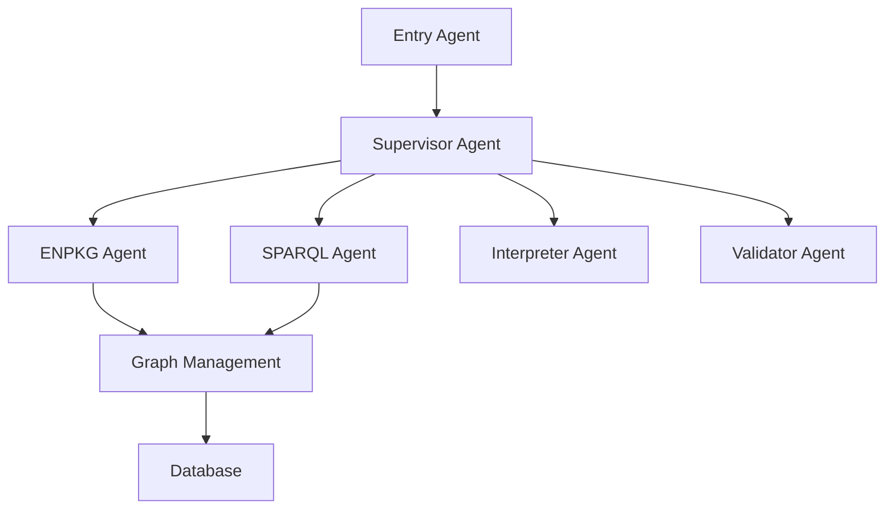

<div class="hero">
  <div class="hero__layer layer-1"></div>
  <div class="hero__layer layer-2"></div>
  <div class="hero__layer layer-3"></div>
  <div class="hero__layer layer-4"></div>
  <div class="hero__content">
    <h1 class="hero__title">MetaboT 🚀</h1>
    <p class="hero__subtitle">A powerful metabolomics analysis tool leveraging AI and graph-based approaches</p>
    <div class="hero__buttons">
      <a href="getting-started/quickstart/" class="hero__button hero__button--primary">Get Started</a>
    </div>
  </div>
</div>
<div style="height: 6vh;"></div>


# Welcome to MetaboT 🚀

## Key Features ✨

- **AI-Powered Analysis** :robot:: Utilizes LangChain and various AI agents for intelligent data processing.
- **Graph-Based Architecture** :chart_with_upwards_trend:: Built on robust graph management systems for complex data relationships.
- **SPARQL Integration** :link:: Advanced querying capabilities for metabolomics data.
- **Extensible Framework** :wrench:: Modular design allowing for easy extension and customization.

## Project Overview 🔬 {#project-overview}

MetaboT is designed to help researchers and scientists in:

- Processing and analyzing metabolomics data.
- Identifying complex patterns and relationships.
- Generating insights from metabolomics experiments.
- Managing and querying large-scale metabolomics datasets.

## Quick Links 🔗

- [Installation Guide :arrow_down:](getting-started/installation.md)
- [Quick Start Tutorial :zap:](getting-started/quickstart.md)
- [API Reference :book:](api-reference/core.md)
- [Example Usage :computer:](examples/basic-usage.md)

## Architecture 🏗️

MetaboT is built with a modular architecture consisting of several key components:



## Contributing 🤝

We welcome contributions! Please see our [Contributing Guide](contributing.md) for details on how to:

- Submit bug reports and feature requests
- Contribute code changes
- Improve documentation
- Participate in the community

## License 📜

This project is licensed under the MIT License - see the LICENSE file for details.

## Citation 🔖

If you use MetaboT in your research, please cite:

**MetaboT: A Conversational AI-Agent for Accessible Mass Spectrometry Metabolomics Data Mining**
*Madina Bekbergenova, et al.*

```bibtex
@article{MetaboT2024,
  title = {MetaboT: A Conversational AI-Agent for Accessible Mass Spectrometry Metabolomics Data Mining},
  author = {Bekbergenova, Madina, et al},
  year = {2025,
  journal = {arXiv},
  volume = {},
  publisher = {arXiv},
  url = {https://arxiv.org/abs/}
}
```

**Institutions:** 🔬
- Université Côte d'Azur, CNRS, ICN, Nice, France
- INRIA, Université Côte d'Azur, CNRS, I3S, France
- Interdisciplinary Institute for Artificial Intelligence (3iA) Côte d'Azur, Nice, France
- School of Pharmaceutical Sciences, University of Geneva, Switzerland
- Swiss Institute of Bioinformatics (SIB), Lausanne, Switzerland

<script>
document.body.classList.add("md-home");
</script>

