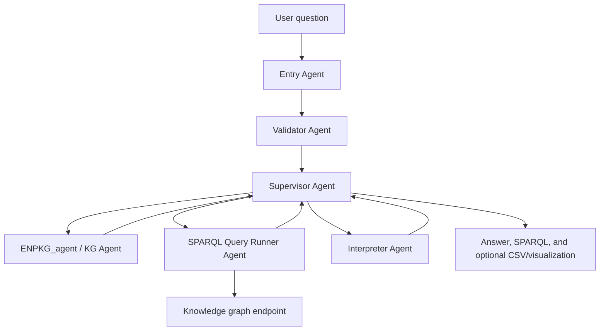

  

    <h1 class="hero__title">MetaboT</h1>
    
Multi-agent LLM framework for querying mass spectrometry metabolomics knowledge graphs in natural language

    

      <a href="getting-started/quickstart/" class="hero__button hero__button--primary">Get Started</a>
      <a href="https://metabot.holobiomicslab.eu" class="hero__button">Try the Demo</a>
    

  

# MetaboT

MetaboT helps researchers ask natural-language questions over metabolomics knowledge graphs and receive answers backed by executable SPARQL queries. The system combines schema-aware prompting, multi-agent orchestration, entity resolution against authoritative resources, and optional interpretation of results.

The public demonstrator is available at [metabot.holobiomicslab.eu](https://metabot.holobiomicslab.eu), and the default local setup targets the ENPKG endpoint built from an open dataset of [1,600 plant extracts](https://doi.org/10.1093/gigascience/giac124).

## Why MetaboT?

- It translates natural-language metabolomics questions into executable SPARQL.
- It reduces hallucinations by resolving taxa, targets, chemical classes, and structures before query generation.
- It exposes a transparent, inspectable workflow instead of a single opaque prompt.
- It can be run from the command line, through Streamlit, or in Docker.

## Validation Snapshot

The latest manuscript reports the following ENPKG benchmark results:

| System | Overall accuracy | High-complexity accuracy |
| --- | ---: | ---: |
| GPT-4o single-shot | 8.16% | 0.00% |
| MetaboT with GPT-4o mini | 12.24% | 15.79% |
| MetaboT with GPT-4o | 83.67% | 78.95% |

These scores are reported over 49 scored questions from a 50-question benchmark, after excluding one refinement artifact discussed in the manuscript.

## Architecture Overview

MetaboT orchestrates six main roles:

1. `Entry Agent` decides whether the user is asking a new knowledge question or a follow-up.
2. `Validator Agent` checks whether the question matches the graph's schema and available data.
3. `Supervisor Agent` routes the request through the workflow.
4. `KG Agent` resolves entities using tools connected to resources such as Wikidata, ChEMBL, NPClassifier, and GNPS.
5. `SPARQL Query Runner Agent` builds and executes the query through `GraphSparqlQAChain`.
6. `Interpreter Agent` summarizes the result and can generate plots when requested.

In the current codebase, the manuscript's `KG Agent` role is implemented by `ENPKG_agent`.

## Workflow at a Glance

```mermaid
graph TD
    A[User question] --> B[Entry Agent]
    B --> C[Validator Agent]
    C --> D[Supervisor Agent]
    D --> E[ENPKG_agent / KG Agent]
    D --> F[SPARQL Query Runner Agent]
    F --> G[Knowledge graph endpoint]
    D --> H[Interpreter Agent]
    E --> D
    F --> D
    H --> D
    D --> I[Answer, SPARQL, and optional CSV/visualization]
```

## Quick Links

- [Installation](getting-started/installation/)
- [Quick Start](getting-started/quickstart/)
- [Overview](user-guide/overview/)
- [Configuration](user-guide/configuration/)
- [Examples](examples/basic-usage/)
- [API Reference](api-reference/core/)
- [Contributing](contributing/)

## Citation

If you use MetaboT, please cite the current manuscript:

**MetaboT: An LLM-based Multi-Agent Framework for Interactive Analysis of Mass Spectrometry Metabolomics Knowledge Graphs**
Research Square preprint. DOI: [10.21203/rs.3.rs-6591884/v1](https://doi.org/10.21203/rs.3.rs-6591884/v1)

The benchmark release and archived evaluated version are available on [Zenodo](https://doi.org/10.5281/zenodo.19701250).

