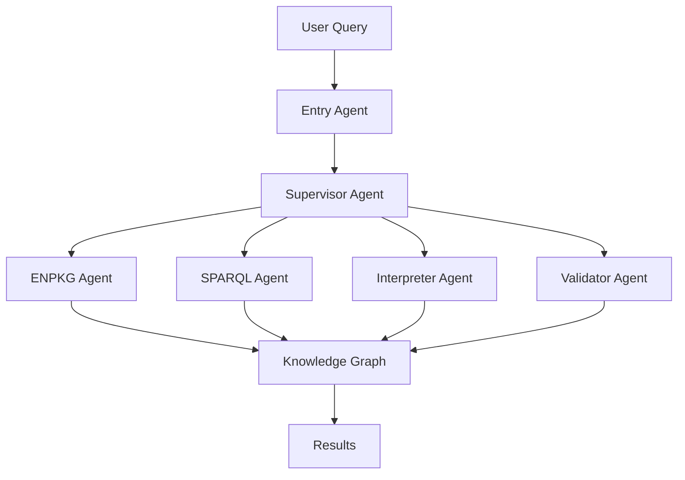
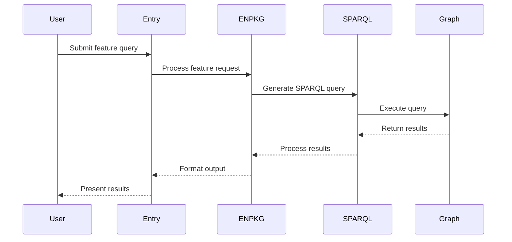
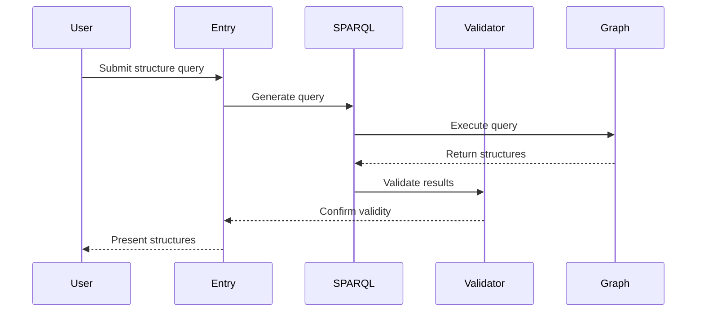

# MetaboT Overview

MetaboT is an advanced metabolomics analysis tool that combines AI-powered agents, graph-based data management, and sophisticated query capabilities to analyze and interpret metabolomics data.

## System Architecture

### Core Components

1. **Entry Agent**
   - Processes initial user queries
   - Performs query validation and preprocessing
   - Routes queries to appropriate processing paths

2. **Supervisor Agent**
   - Orchestrates the workflow between agents
   - Manages state and context throughout query processing
   - Ensures proper sequencing of operations

3. **ENPKG Agent**
   - Handles metabolomics-specific processing
   - Manages chemical structure analysis
   - Processes bioassay data

4. **SPARQL Agent**
   - Executes queries against the RDF knowledge graph
   - Optimizes query performance
   - Handles complex graph traversals

5. **Interpreter Agent**
   - Processes and formats query results
   - Generates human-readable outputs
   - Handles data visualization requests

6. **Validator Agent**
   - Ensures data quality and consistency
   - Validates query results
   - Performs error checking

### Knowledge Graph Integration

MetaboT utilizes a sophisticated RDF-based knowledge graph that:

- Stores metabolomics data and relationships
- Enables complex query capabilities
- Supports data integration from multiple sources
- Maintains data provenance

**Note:** By default, MetaboT connects to the public ENPKG endpoint, which hosts an annotated mass spectrometry dataset derived from 1,600 plant extracts. This default dataset is provided to help you explore and understand the capabilities of MetaboT without needing a custom data conversion workflow immediately.

## Key Features

### 1. Query Processing

MetaboT supports various types of queries:

- **Standard Queries**: Pre-defined queries for common analyses
- **Custom Queries**: User-defined natural language queries
- **SPARQL Queries**: Direct graph database queries

### 2. Data Analysis Capabilities

- **Chemical Structure Analysis**
  - SIRIUS/CSI:FingerID integration
  - ISDB annotation support
  - Structure similarity comparisons

- **Metabolomics Analysis**
  - Feature detection and analysis
  - Ionization mode processing
  - Retention time analysis

- **Bioassay Integration**
  - Activity data analysis
  - Inhibition studies
  - Concentration-response relationships

### 3. AI-Powered Processing

MetaboT leverages advanced AI capabilities through:

- **Language Models**
  - Natural language query processing
  - Context-aware responses
  - Intelligent result interpretation

- **Agent Collaboration**
  - Multi-agent workflow coordination
  - Specialized task processing
  - Adaptive response generation

## Workflow Examples

### 1. Basic Feature Analysis

### 2. Chemical Structure Analysis

## Performance Considerations

### Query Optimization

- Use specific queries when possible
- Leverage standard queries for common operations
- Consider query complexity and data volume

### Resource Management

- Monitor memory usage during large queries
- Consider batch processing for extensive analyses
- Utilize caching when appropriate

## Best Practices

1. **Query Design**
   - Start with standard queries when possible
   - Build custom queries incrementally
   - Test queries with smaller datasets first

2. **Data Management**
   - Regularly update knowledge graph data
   - Maintain consistent data formats
   - Document custom queries and workflows

3. **System Configuration**
   - Keep environment variables updated
   - Monitor system resources
   - Regular maintenance of graph database

## Integration Capabilities

MetaboT can be integrated with:

- External databases
- Custom analysis pipelines
- Visualization tools
- Reporting systems

## Future Developments

Planned enhancements include:

- Enhanced visualization capabilities
- Additional analysis algorithms
- Expanded database integrations
- Improved performance optimization

For detailed information about specific components, please refer to the respective sections in the documentation.