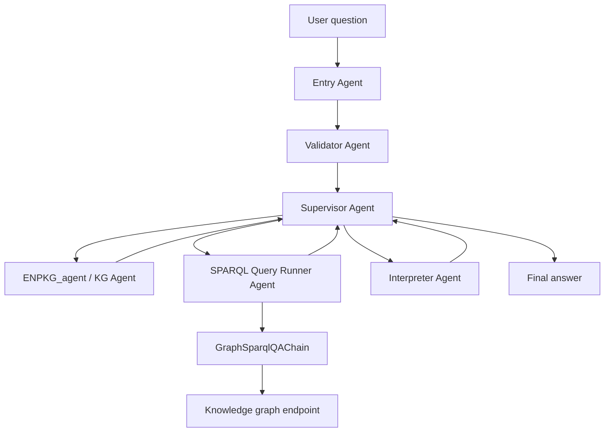
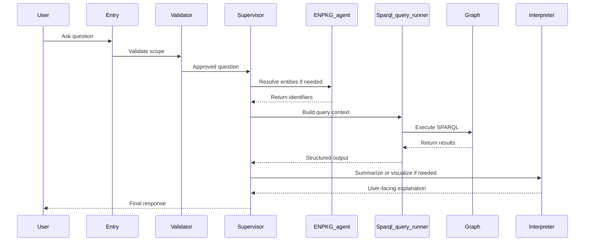

# Overview

MetaboT is a modular multi-agent system for translating natural-language metabolomics questions into executable SPARQL queries over a knowledge graph. It is designed for researchers who want the power of semantic querying without having to write SPARQL manually for every task.

The current repository defaults to the ENPKG endpoint, but the design is intended to be portable to other RDF knowledge graphs with schema-aware prompt updates.

## Core Idea

Instead of relying on a single prompt to infer everything, MetaboT decomposes the job into smaller steps:

- validate whether the question fits the graph
- resolve real-world entities to graph-compatible identifiers
- generate SPARQL with explicit schema context
- refine failed queries when needed
- summarize results for the user

This separation is especially useful in metabolomics, where taxa, chemical classes, structures, and biological targets all need precise identifiers.

## Main Agents

### Entry Agent

The gateway to the system. It distinguishes between new knowledge requests and follow-up interpretation questions, and it can inspect user-provided files before routing.

### Validator Agent

Checks whether a question is in scope for the knowledge graph. It uses prompt-level schema context and plant validation logic to reject clearly invalid questions early.

### Supervisor Agent

Coordinates the workflow. It decides whether entity resolution is needed and routes the request between the specialized agents.

### KG Agent

The manuscript refers to a `KG Agent`; in the current codebase this role is implemented by `ENPKG_agent`. This agent resolves entities to authoritative identifiers before SPARQL generation.

Examples include:

- plant and taxon names via Wikidata
- chemical classes via NPClassifier-derived resources
- biological targets via ChEMBL
- SMILES strings via GNPS-linked resolution tools

### SPARQL Query Runner Agent

Prepares the full context needed for query generation and hands the work to `GraphSparqlQAChain`. This includes the question, resolved identifiers, and schema fragments relevant to the target graph.

### Interpreter Agent

Turns raw outputs into user-facing summaries and can create plots or spectrum links when requested.

## Workflow Diagram

```mermaid
graph TD
    A[User question] --> B[Entry Agent]
    B --> C[Validator Agent]
    C --> D[Supervisor Agent]
    D --> E[ENPKG_agent / KG Agent]
    D --> F[SPARQL Query Runner Agent]
    F --> G[GraphSparqlQAChain]
    G --> H[Knowledge graph endpoint]
    D --> I[Interpreter Agent]
    E --> D
    F --> D
    I --> D
    D --> J[Final answer]
```

## Query Lifecycle

```mermaid
sequenceDiagram
    participant User
    participant Entry
    participant Validator
    participant Supervisor
    participant KG as ENPKG_agent
    participant SPARQL as Sparql_query_runner
    participant Graph
    participant Interpreter

    User->>Entry: Ask question
    Entry->>Validator: Validate scope
    Validator->>Supervisor: Approved question
    Supervisor->>KG: Resolve entities if needed
    KG-->>Supervisor: Return identifiers
    Supervisor->>SPARQL: Build query context
    SPARQL->>Graph: Execute SPARQL
    Graph-->>SPARQL: Return results
    SPARQL-->>Supervisor: Structured output
    Supervisor->>Interpreter: Summarize or visualize if needed
    Interpreter-->>Supervisor: User-facing explanation
    Supervisor-->>User: Final response
```

## Key Tools

MetaboT's agents are backed by specialized tools, including:

- `PlantDatabaseChecker`
- `ChemicalResolver`
- `SMILESResolver`
- `TargetResolver`
- `TaxonResolver`
- `GraphSparqlQAChain`
- `WikidataStructureSearch`
- `OutputMerger`
- `Interpreter`
- `SpectrumPlotter`

Together, these tools help MetaboT ground identifiers before query generation and keep the system aligned with the target graph.

## Query Generation Strategy

`GraphSparqlQAChain` follows a staged approach:

1. Generate an initial SPARQL query using the user question, resolved entities, and schema context.
2. Execute the query and inspect whether the result is useful.
3. If the query fails or returns no results, try one refinement pass using schema hints and similar stored examples.

This refinement step is important because it helps distinguish between:

- a badly constructed query
- a legitimate absence of data in the knowledge graph

## Supported Outputs

Depending on the question, MetaboT can return:

- a textual answer
- the generated SPARQL query
- a path to a CSV result file
- a visualization request handled by the interpreter
- spectrum URLs when a USI is involved

## Validation Results

In the current manuscript, the strongest evaluated configuration reached:

- **83.67% overall accuracy**
- **78.95% accuracy on high-complexity questions**

This was reported on a 49-question scored subset of a 50-question benchmark released with the project in `app/data/evaluation_dataset.csv`.

## Scope and Limitations

MetaboT is strongest when:

- the question maps cleanly to the schema of the target graph
- entities can be resolved to authoritative identifiers
- the endpoint exposes rich metabolomics annotations

Current limitations include:

- dependence on a capable LLM for best performance
- occasional SPARQL generation errors on difficult questions
- single-graph querying rather than full federated SPARQL across many external resources
- evaluation that focuses mainly on query generation, not every downstream interpretation behavior

## Where to Go Next

- Use the [Quick Start](../getting-started/quickstart.md) for first runs
- Tune providers and endpoints in the [Configuration Guide](configuration.md)
- Explore practical prompts in [Examples](../examples/basic-usage.md)
